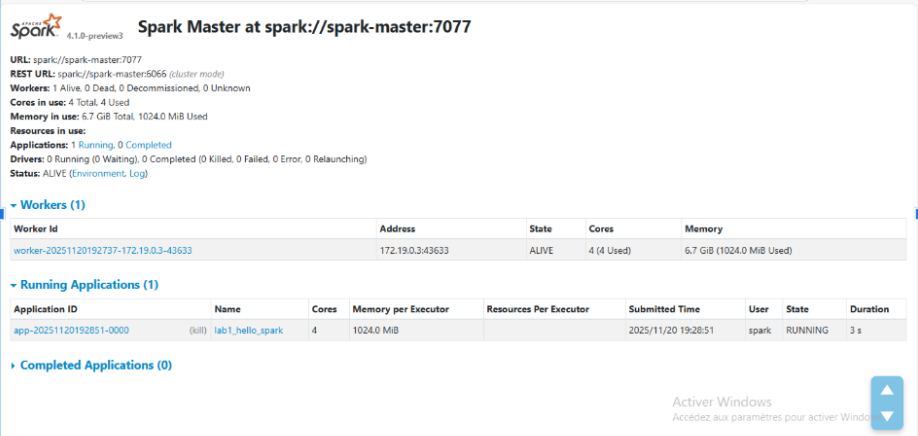
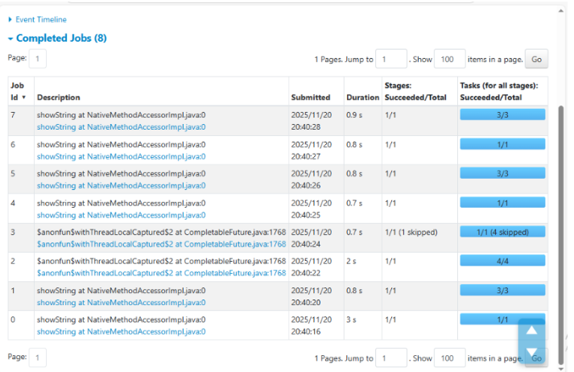
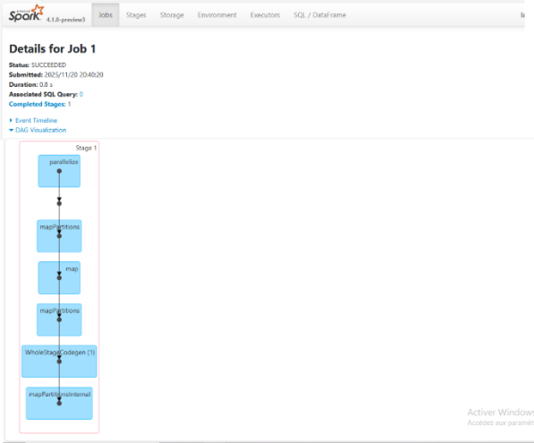
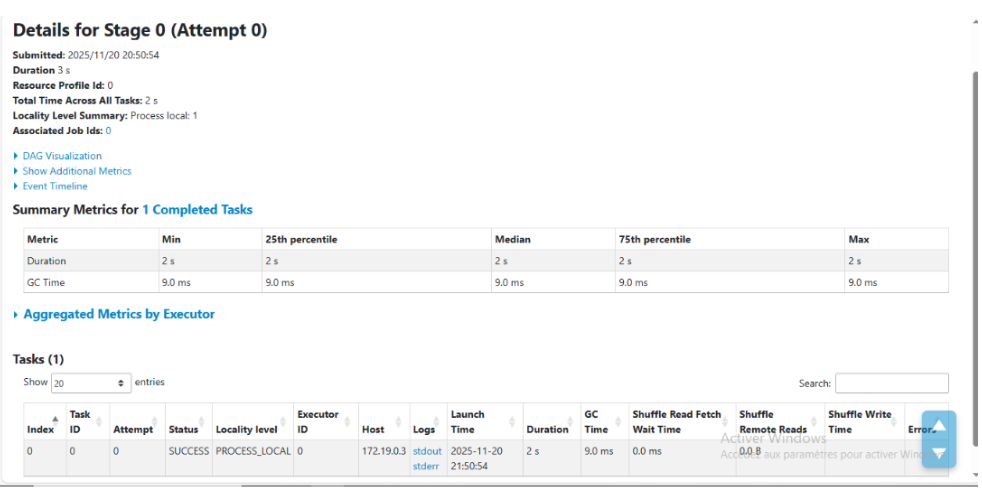
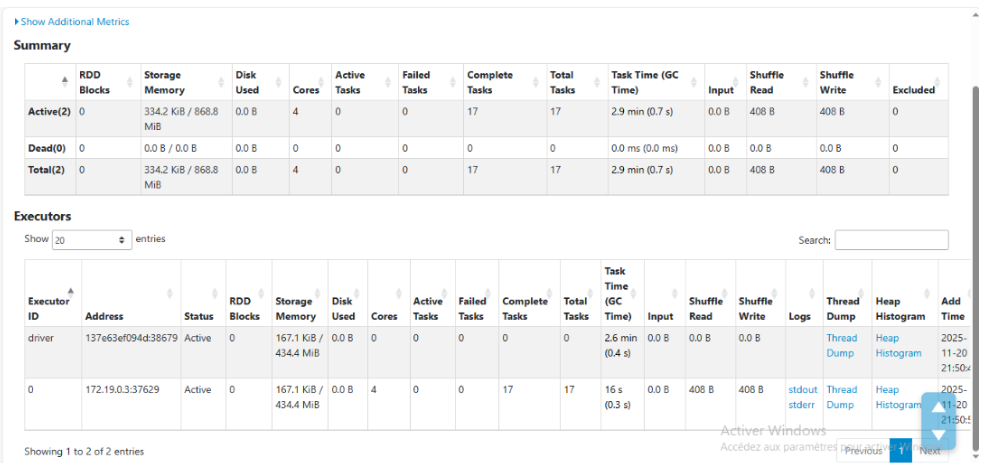

# 1 — Spark Master UI Screenshot

# 2 — Terminal Output of Your Spark Application

C:\Users\user\Desktop\data-engineering-course>docker exec spark-master /opt/spark/bin/spark-submit /opt/spark/lab1_hello_spark.py
WARNING: Using incubator modules: jdk.incubator.vector
Using Spark's default log4j profile: org/apache/spark/log4j2-defaults.properties
25/11/20 20:50:39 INFO SparkContext: Running Spark version 4.1.0-preview3
25/11/20 20:50:39 INFO SparkContext: OS info Linux, 6.6.87.2-microsoft-standard-WSL2, amd64
25/11/20 20:50:39 INFO SparkContext: Java version 17.0.16+8
25/11/20 20:50:39 WARN NativeCodeLoader: Unable to load native-hadoop library for your platform... using builtin-java classes where applicable
25/11/20 20:50:39 INFO ResourceUtils: ==============================================================
25/11/20 20:50:39 INFO ResourceUtils: No custom resources configured for spark.driver.
25/11/20 20:50:39 INFO ResourceUtils: ==============================================================
25/11/20 20:50:39 INFO SparkContext: Submitted application: lab1_hello_spark
25/11/20 20:50:40 INFO SecurityManager: Changing view acls to: spark
25/11/20 20:50:40 INFO SecurityManager: Changing modify acls to: spark
25/11/20 20:50:40 INFO SecurityManager: Changing view acls groups to: spark
25/11/20 20:50:40 INFO SecurityManager: Changing modify acls groups to: spark
25/11/20 20:50:40 INFO SecurityManager: SecurityManager: authentication disabled; ui acls disabled; users with view permissions: spark groups with view permissions: EMPTY; users with modify permissions: spark; groups with modify permissions: EMPTY; RPC SSL disabled
25/11/20 20:50:40 INFO Utils: Successfully started service 'sparkDriver' on port 39207.
25/11/20 20:50:40 INFO SparkEnv: Registering MapOutputTracker
25/11/20 20:50:40 INFO SparkEnv: Registering BlockManagerMaster
25/11/20 20:50:40 INFO BlockManagerMasterEndpoint: Using org.apache.spark.storage.DefaultTopologyMapper for getting topology information
25/11/20 20:50:40 INFO BlockManagerMasterEndpoint: BlockManagerMasterEndpoint up
25/11/20 20:50:40 INFO SparkEnv: Registering BlockManagerMasterHeartbeat
25/11/20 20:50:40 INFO DiskBlockManager: Created local directory at /tmp/blockmgr-c27de6e7-ae81-40de-a1b6-0679e5e3741d
25/11/20 20:50:40 INFO SparkEnv: Registering OutputCommitCoordinator
25/11/20 20:50:41 INFO JettyUtils: Start Jetty 0.0.0.0:4040 for SparkUI
25/11/20 20:50:41 INFO Utils: Successfully started service 'SparkUI' on port 4040.
25/11/20 20:50:41 INFO ResourceProfile: Default ResourceProfile created, executor resources: Map(memory -> name: memory, amount: 1024, script: , vendor: , offHeap -> name: offHeap, amount: 0, script: , vendor: ), task resources: Map(cpus -> name: cpus, amount: 1.0)
25/11/20 20:50:41 INFO ResourceProfile: Limiting resource is cpu
25/11/20 20:50:41 INFO ResourceProfileManager: Added ResourceProfile id: 0
25/11/20 20:50:41 INFO SecurityManager: Changing view acls to: spark
25/11/20 20:50:41 INFO SecurityManager: Changing modify acls to: spark
25/11/20 20:50:41 INFO SecurityManager: Changing view acls groups to: spark
25/11/20 20:50:41 INFO SecurityManager: Changing modify acls groups to: spark
25/11/20 20:50:41 INFO SecurityManager: SecurityManager: authentication disabled; ui acls disabled; users with view permissions: spark groups with view permissions: EMPTY; users with modify permissions: spark; groups with modify permissions: EMPTY; RPC SSL disabled
25/11/20 20:50:41 INFO StandaloneAppClient$ClientEndpoint: Connecting to master spark://spark-master:7077...
25/11/20 20:50:41 INFO TransportClientFactory: Successfully created connection to spark-master/172.19.0.2:7077 after 52 ms (0 ms spent in bootstraps)
25/11/20 20:50:42 INFO StandaloneSchedulerBackend: Connected to Spark cluster with app ID app-20251120205042-0001
25/11/20 20:50:42 INFO StandaloneAppClient$ClientEndpoint: Executor added: app-20251120205042-0001/0 on worker-20251120203952-172.19.0.3-42327 (172.19.0.3:42327) with 4 core(s)
25/11/20 20:50:42 INFO StandaloneSchedulerBackend: Granted executor ID app-20251120205042-0001/0 on hostPort 172.19.0.3:42327 with 4 core(s), 1024.0 MiB RAM
25/11/20 20:50:42 INFO Utils: Successfully started service 'org.apache.spark.network.netty.NettyBlockTransferService' on port 38679.
25/11/20 20:50:42 INFO NettyBlockTransferService: Server created on 137e63ef094d:38679
25/11/20 20:50:42 INFO BlockManager: Using org.apache.spark.storage.RandomBlockReplicationPolicy for block replication policy
25/11/20 20:50:42 INFO BlockManagerMaster: Registering BlockManager BlockManagerId(driver, 137e63ef094d, 38679, None)
25/11/20 20:50:42 INFO StandaloneAppClient$ClientEndpoint: Executor updated: app-20251120205042-0001/0 is now RUNNING
25/11/20 20:50:42 INFO BlockManagerMasterEndpoint: Registering block manager 137e63ef094d:38679 with 434.4 MiB RAM, BlockManagerId(driver, 137e63ef094d, 38679, None)
25/11/20 20:50:42 INFO BlockManagerMaster: Registered BlockManager BlockManagerId(driver, 137e63ef094d, 38679, None)
25/11/20 20:50:42 INFO BlockManager: Initialized BlockManager: BlockManagerId(driver, 137e63ef094d, 38679, None)
25/11/20 20:50:42 INFO StandaloneSchedulerBackend: SchedulerBackend is ready for scheduling beginning after reached minRegisteredResourcesRatio: 0.0
25/11/20 20:50:50 INFO StandaloneSchedulerBackend$StandaloneDriverEndpoint: Registered executor NettyRpcEndpointRef(spark-client://Executor) (172.19.0.3:40574) with ID 0, ResourceProfileId 0
##############  SparkSession initialisée ####################
Version: 4.1.0-preview3
UI disponible sur: http://localhost:4040
25/11/20 20:50:50 INFO SharedState: Setting hive.metastore.warehouse.dir ('null') to the value of spark.sql.warehouse.dir.
25/11/20 20:50:50 INFO SharedState: Warehouse path is 'file:/opt/spark/work-dir/spark-warehouse'.
25/11/20 20:50:51 INFO BlockManagerMasterEndpoint: Registering block manager 172.19.0.3:37629 with 434.4 MiB RAM, BlockManagerId(0, 172.19.0.3, 37629, None)
 #################DataFrame créé ########################

 ****************** Schéma: ****************************
root
 |-- Name: string (nullable = true)
 |-- Department: string (nullable = true)
 |-- Salary: long (nullable = true)
 |-- Age: long (nullable = true)

 ********************** Données: *************************
25/11/20 20:50:54 INFO CodeGenerator: Code generated in 325.393751 ms
25/11/20 20:50:54 INFO SparkContext: Starting job: showString at NativeMethodAccessorImpl.java:0
25/11/20 20:50:54 INFO DAGScheduler: Got job 0 (showString at NativeMethodAccessorImpl.java:0) with 1 output partitions
25/11/20 20:50:54 INFO DAGScheduler: Final stage: ResultStage 0 (showString at NativeMethodAccessorImpl.java:0)
25/11/20 20:50:54 INFO DAGScheduler: Parents of final stage: List()
25/11/20 20:50:54 INFO DAGScheduler: Missing parents: List()
25/11/20 20:50:54 INFO DAGScheduler: Missing parents found for ResultStage 0: List()
25/11/20 20:50:54 INFO DAGScheduler: Submitting ResultStage 0 (MapPartitionsRDD[6] at showString at NativeMethodAccessorImpl.java:0), which has no missing parents
25/11/20 20:50:54 INFO MemoryStore: MemoryStore started with capacity 434.4 MiB
25/11/20 20:50:54 INFO MemoryStore: Block broadcast_0 stored as values in memory (estimated size 14.5 KiB, free 434.4 MiB)
25/11/20 20:50:54 INFO MemoryStore: Block broadcast_0_piece0 stored as bytes in memory (estimated size 7.3 KiB, free 434.4 MiB)
25/11/20 20:50:54 INFO SparkContext: Created broadcast 0 from broadcast at DAGScheduler.scala:1701
25/11/20 20:50:54 INFO DAGScheduler: Submitting 1 missing tasks from ResultStage 0 (MapPartitionsRDD[6] at showString at NativeMethodAccessorImpl.java:0) (first 15 tasks are for partitions Vector(0))
25/11/20 20:50:54 INFO TaskSchedulerImpl: Adding task set 0.0 with 1 tasks resource profile 0
25/11/20 20:50:54 INFO TaskSetManager: Starting task 0.0 in stage 0.0 (TID 0) (172.19.0.3,executor 0, partition 0, PROCESS_LOCAL, 9725 bytes)
25/11/20 20:50:57 INFO TaskSetManager: Finished task 0.0 in stage 0.0 (TID 0) in 3151 ms on 172.19.0.3 (executor 0) (1/1)
25/11/20 20:50:57 INFO TaskSchedulerImpl: Removed TaskSet 0.0 whose tasks have all completed, from pool
25/11/20 20:50:57 INFO PythonAccumulatorV2: Connected to AccumulatorServer at host: 127.0.0.1 port: 59141
25/11/20 20:50:57 INFO DAGScheduler: ResultStage 0 (showString at NativeMethodAccessorImpl.java:0) finished in 3470 ms
25/11/20 20:50:57 INFO DAGScheduler: Job 0 is finished. Cancelling potential speculative or zombie tasks for this job
25/11/20 20:50:57 INFO TaskSchedulerImpl: Canceling stage 0
25/11/20 20:50:57 INFO TaskSchedulerImpl: Killing all running tasks in stage 0: Stage finished
25/11/20 20:50:57 INFO DAGScheduler: Job 0 finished: showString at NativeMethodAccessorImpl.java:0, took 3602.960627 ms
25/11/20 20:50:57 INFO SparkContext: Starting job: showString at NativeMethodAccessorImpl.java:0
25/11/20 20:50:57 INFO DAGScheduler: Got job 1 (showString at NativeMethodAccessorImpl.java:0) with 3 output partitions
25/11/20 20:50:57 INFO DAGScheduler: Final stage: ResultStage 1 (showString at NativeMethodAccessorImpl.java:0)
25/11/20 20:50:57 INFO DAGScheduler: Parents of final stage: List()
25/11/20 20:50:57 INFO DAGScheduler: Missing parents: List()
25/11/20 20:50:57 INFO DAGScheduler: Missing parents found for ResultStage 1: List()
25/11/20 20:50:57 INFO DAGScheduler: Submitting ResultStage 1 (MapPartitionsRDD[6] at showString at NativeMethodAccessorImpl.java:0), which has no missing parents
25/11/20 20:50:57 INFO MemoryStore: Block broadcast_1 stored as values in memory (estimated size 14.5 KiB, free 434.4 MiB)
25/11/20 20:50:57 INFO MemoryStore: Block broadcast_1_piece0 stored as bytes in memory (estimated size 7.3 KiB, free 434.4 MiB)
25/11/20 20:50:57 INFO SparkContext: Created broadcast 1 from broadcast at DAGScheduler.scala:1701
25/11/20 20:50:57 INFO DAGScheduler: Submitting 3 missing tasks from ResultStage 1 (MapPartitionsRDD[6] at showString at NativeMethodAccessorImpl.java:0) (first 15 tasks are for partitions Vector(1, 2, 3))
25/11/20 20:50:57 INFO TaskSchedulerImpl: Adding task set 1.0 with 3 tasks resource profile 0
25/11/20 20:50:57 INFO TaskSetManager: Starting task 0.0 in stage 1.0 (TID 1) (172.19.0.3,executor 0, partition 1, PROCESS_LOCAL, 9730 bytes)
25/11/20 20:50:57 INFO TaskSetManager: Starting task 1.0 in stage 1.0 (TID 2) (172.19.0.3,executor 0, partition 2, PROCESS_LOCAL, 9727 bytes)
25/11/20 20:50:57 INFO TaskSetManager: Starting task 2.0 in stage 1.0 (TID 3) (172.19.0.3,executor 0, partition 3, PROCESS_LOCAL, 9776 bytes)
25/11/20 20:50:58 INFO TaskSetManager: Finished task 1.0 in stage 1.0 (TID 2) in 407 ms on 172.19.0.3 (executor 0) (1/3)
25/11/20 20:50:58 INFO TaskSetManager: Finished task 2.0 in stage 1.0 (TID 3) in 498 ms on 172.19.0.3 (executor 0) (2/3)
25/11/20 20:50:58 INFO TaskSetManager: Finished task 0.0 in stage 1.0 (TID 1) in 557 ms on 172.19.0.3 (executor 0) (3/3)
25/11/20 20:50:58 INFO TaskSchedulerImpl: Removed TaskSet 1.0 whose tasks have all completed, from pool
25/11/20 20:50:58 INFO DAGScheduler: ResultStage 1 (showString at NativeMethodAccessorImpl.java:0) finished in 595 ms
25/11/20 20:50:58 INFO DAGScheduler: Job 1 is finished. Cancelling potential speculative or zombie tasks for this job
25/11/20 20:50:58 INFO TaskSchedulerImpl: Canceling stage 1
25/11/20 20:50:58 INFO TaskSchedulerImpl: Killing all running tasks in stage 1: Stage finished
25/11/20 20:50:58 INFO DAGScheduler: Job 1 finished: showString at NativeMethodAccessorImpl.java:0, took 608.858829 ms
25/11/20 20:50:58 INFO CodeGenerator: Code generated in 44.380722 ms
+-------+----------+------+---+
|   Name|Department|Salary|Age|
+-------+----------+------+---+
|  Alice|        IT|  5000| 28|
|    Bob| Marketing|  4500| 32|
|Charlie|        IT|  6000| 35|
|  Diana|        HR|  4000| 29|
|    Eve| Marketing|  4800| 31|
+-------+----------+------+---+

 #################### Salaire moyen par département: ############################
25/11/20 20:50:59 INFO CodeGenerator: Code generated in 175.201957 ms
25/11/20 20:50:59 INFO DAGScheduler: Registering RDD 8 ($anonfun$withThreadLocalCaptured$2 at CompletableFuture.java:1768) as input to shuffle 0
25/11/20 20:50:59 INFO DAGScheduler: Got map stage job 2 ($anonfun$withThreadLocalCaptured$2 at CompletableFuture.java:1768) with 4 output partitions
25/11/20 20:50:59 INFO DAGScheduler: Final stage: ShuffleMapStage 2 ($anonfun$withThreadLocalCaptured$2 at CompletableFuture.java:1768)
25/11/20 20:50:59 INFO DAGScheduler: Parents of final stage: List()
25/11/20 20:50:59 INFO DAGScheduler: Missing parents: List()
25/11/20 20:50:59 INFO DAGScheduler: Missing parents found for ShuffleMapStage 2: List()
25/11/20 20:50:59 INFO DAGScheduler: Submitting ShuffleMapStage 2 (MapPartitionsRDD[8] at $anonfun$withThreadLocalCaptured$2 at CompletableFuture.java:1768), which has no missing parents
25/11/20 20:50:59 INFO MemoryStore: Block broadcast_2 stored as values in memory (estimated size 40.1 KiB, free 434.4 MiB)
25/11/20 20:50:59 INFO MemoryStore: Block broadcast_2_piece0 stored as bytes in memory (estimated size 18.3 KiB, free 434.3 MiB)
25/11/20 20:50:59 INFO SparkContext: Created broadcast 2 from broadcast at DAGScheduler.scala:1701
25/11/20 20:50:59 INFO DAGScheduler: Submitting 4 missing tasks from ShuffleMapStage 2 (MapPartitionsRDD[8] at $anonfun$withThreadLocalCaptured$2 at CompletableFuture.java:1768) (first 15 tasks are for partitions Vector(0, 1, 2, 3))
25/11/20 20:50:59 INFO TaskSchedulerImpl: Adding task set 2.0 with 4 tasks resource profile 0
25/11/20 20:50:59 INFO TaskSetManager: Starting task 0.0 in stage 2.0 (TID 4) (172.19.0.3,executor 0, partition 0, PROCESS_LOCAL, 9714 bytes)
25/11/20 20:50:59 INFO TaskSetManager: Starting task 1.0 in stage 2.0 (TID 5) (172.19.0.3,executor 0, partition 1, PROCESS_LOCAL, 9719 bytes)
25/11/20 20:50:59 INFO TaskSetManager: Starting task 2.0 in stage 2.0 (TID 6) (172.19.0.3,executor 0, partition 2, PROCESS_LOCAL, 9716 bytes)
25/11/20 20:50:59 INFO TaskSetManager: Starting task 3.0 in stage 2.0 (TID 7) (172.19.0.3,executor 0, partition 3, PROCESS_LOCAL, 9765 bytes)
25/11/20 20:51:01 INFO TaskSetManager: Finished task 0.0 in stage 2.0 (TID 4) in 1656 ms on 172.19.0.3 (executor 0) (1/4)
25/11/20 20:51:01 INFO TaskSetManager: Finished task 2.0 in stage 2.0 (TID 6) in 1655 ms on 172.19.0.3 (executor 0) (2/4)
25/11/20 20:51:01 INFO TaskSetManager: Finished task 1.0 in stage 2.0 (TID 5) in 1663 ms on 172.19.0.3 (executor 0) (3/4)
25/11/20 20:51:01 INFO TaskSetManager: Finished task 3.0 in stage 2.0 (TID 7) in 1737 ms on 172.19.0.3 (executor 0) (4/4)
25/11/20 20:51:01 INFO TaskSchedulerImpl: Removed TaskSet 2.0 whose tasks have all completed, from pool
25/11/20 20:51:01 INFO DAGScheduler: ShuffleMapStage 2 ($anonfun$withThreadLocalCaptured$2 at CompletableFuture.java:1768) finished in 1811 ms
25/11/20 20:51:01 INFO DAGScheduler: looking for newly runnable stages
25/11/20 20:51:01 INFO DAGScheduler: running: HashSet()
25/11/20 20:51:01 INFO DAGScheduler: waiting: HashSet()
25/11/20 20:51:01 INFO DAGScheduler: failed: HashSet()
25/11/20 20:51:01 INFO ShufflePartitionsUtil: For shuffle(0, advisory target size: 67108864, actual target size 1048576, minimum partition size: 1048576
25/11/20 20:51:01 INFO HashAggregateExec: spark.sql.codegen.aggregate.map.twolevel.enabled is set to true, but current version of codegened fast hashmap does not support this aggregate.
25/11/20 20:51:01 INFO CodeGenerator: Code generated in 55.176588 ms
25/11/20 20:51:01 INFO SparkContext: Starting job: $anonfun$withThreadLocalCaptured$2 at CompletableFuture.java:1768
25/11/20 20:51:01 INFO DAGScheduler: Got job 3 ($anonfun$withThreadLocalCaptured$2 at CompletableFuture.java:1768) with 1 output partitions
25/11/20 20:51:01 INFO DAGScheduler: Final stage: ResultStage 4 ($anonfun$withThreadLocalCaptured$2 at CompletableFuture.java:1768)
25/11/20 20:51:01 INFO DAGScheduler: Parents of final stage: List(ShuffleMapStage 3)
25/11/20 20:51:01 INFO DAGScheduler: Missing parents: List()
25/11/20 20:51:01 INFO DAGScheduler: Missing parents found for ResultStage 4: List()
25/11/20 20:51:01 INFO DAGScheduler: Submitting ResultStage 4 (MapPartitionsRDD[11] at $anonfun$withThreadLocalCaptured$2 at CompletableFuture.java:1768), which has no missing parents
25/11/20 20:51:01 INFO MemoryStore: Block broadcast_3 stored as values in memory (estimated size 46.3 KiB, free 434.3 MiB)
25/11/20 20:51:01 INFO MemoryStore: Block broadcast_3_piece0 stored as bytes in memory (estimated size 20.6 KiB, free 434.3 MiB)
25/11/20 20:51:01 INFO SparkContext: Created broadcast 3 from broadcast at DAGScheduler.scala:1701
25/11/20 20:51:01 INFO DAGScheduler: Submitting 1 missing tasks from ResultStage 4 (MapPartitionsRDD[11] at $anonfun$withThreadLocalCaptured$2 at CompletableFuture.java:1768) (first 15 tasks are for partitions Vector(0))
25/11/20 20:51:01 INFO TaskSchedulerImpl: Adding task set 4.0 with 1 tasks resource profile 0
25/11/20 20:51:01 INFO TaskSetManager: Starting task 0.0 in stage 4.0 (TID 8) (172.19.0.3,executor 0, partition 0, NODE_LOCAL, 9635 bytes)
25/11/20 20:51:02 INFO MapOutputTrackerMasterEndpoint: Asked to send map output locations for shuffle 0 to 172.19.0.3:40574
25/11/20 20:51:02 INFO TaskSetManager: Finished task 0.0 in stage 4.0 (TID 8) in 708 ms on 172.19.0.3 (executor 0) (1/1)
25/11/20 20:51:02 INFO TaskSchedulerImpl: Removed TaskSet 4.0 whose tasks have all completed, from pool
25/11/20 20:51:02 INFO DAGScheduler: ResultStage 4 ($anonfun$withThreadLocalCaptured$2 at CompletableFuture.java:1768) finished in 780 ms
25/11/20 20:51:02 INFO DAGScheduler: Job 3 is finished. Cancelling potential speculative or zombie tasks for this job
25/11/20 20:51:02 INFO TaskSchedulerImpl: Canceling stage 4
25/11/20 20:51:02 INFO TaskSchedulerImpl: Killing all running tasks in stage 4: Stage finished
25/11/20 20:51:02 INFO DAGScheduler: Job 3 finished: $anonfun$withThreadLocalCaptured$2 at CompletableFuture.java:1768, took 832.266963 ms
25/11/20 20:51:02 INFO CodeGenerator: Code generated in 59.522887 ms
+----------+---------+-----+
|Department|AvgSalary|Count|
+----------+---------+-----+
|        IT|   5500.0|    2|
| Marketing|   4650.0|    2|
|        HR|   4000.0|    1|
+----------+---------+-----+

 $$$$$$$$$$$$$$$$$$$ Employés avec salaire > 5000: $$$$$$$$$$$$$$$$$$$$$$$$$$$$$$
25/11/20 20:51:03 INFO CodeGenerator: Code generated in 23.137682 ms
25/11/20 20:51:03 INFO SparkContext: Starting job: showString at NativeMethodAccessorImpl.java:0
25/11/20 20:51:03 INFO DAGScheduler: Got job 4 (showString at NativeMethodAccessorImpl.java:0) with 1 output partitions
25/11/20 20:51:03 INFO DAGScheduler: Final stage: ResultStage 5 (showString at NativeMethodAccessorImpl.java:0)
25/11/20 20:51:03 INFO DAGScheduler: Parents of final stage: List()
25/11/20 20:51:03 INFO DAGScheduler: Missing parents: List()
25/11/20 20:51:03 INFO DAGScheduler: Missing parents found for ResultStage 5: List()
25/11/20 20:51:03 INFO DAGScheduler: Submitting ResultStage 5 (MapPartitionsRDD[13] at showString at NativeMethodAccessorImpl.java:0), which has no missing parents
25/11/20 20:51:03 INFO MemoryStore: Block broadcast_4 stored as values in memory (estimated size 14.9 KiB, free 434.3 MiB)
25/11/20 20:51:03 INFO MemoryStore: Block broadcast_4_piece0 stored as bytes in memory (estimated size 7.5 KiB, free 434.3 MiB)
25/11/20 20:51:03 INFO SparkContext: Created broadcast 4 from broadcast at DAGScheduler.scala:1701
25/11/20 20:51:03 INFO DAGScheduler: Submitting 1 missing tasks from ResultStage 5 (MapPartitionsRDD[13] at showString at NativeMethodAccessorImpl.java:0) (first 15 tasks are for partitions Vector(0))
25/11/20 20:51:03 INFO TaskSchedulerImpl: Adding task set 5.0 with 1 tasks resource profile 0
25/11/20 20:51:03 INFO TaskSetManager: Starting task 0.0 in stage 5.0 (TID 9) (172.19.0.3,executor 0, partition 0, PROCESS_LOCAL, 9725 bytes)
25/11/20 20:51:03 INFO TaskSetManager: Finished task 0.0 in stage 5.0 (TID 9) in 461 ms on 172.19.0.3 (executor 0) (1/1)
25/11/20 20:51:03 INFO TaskSchedulerImpl: Removed TaskSet 5.0 whose tasks have all completed, from pool
25/11/20 20:51:03 INFO DAGScheduler: ResultStage 5 (showString at NativeMethodAccessorImpl.java:0) finished in 509 ms
25/11/20 20:51:03 INFO DAGScheduler: Job 4 is finished. Cancelling potential speculative or zombie tasks for this job
25/11/20 20:51:03 INFO TaskSchedulerImpl: Canceling stage 5
25/11/20 20:51:03 INFO TaskSchedulerImpl: Killing all running tasks in stage 5: Stage finished
25/11/20 20:51:03 INFO DAGScheduler: Job 4 finished: showString at NativeMethodAccessorImpl.java:0, took 534.71334 ms
25/11/20 20:51:03 INFO SparkContext: Starting job: showString at NativeMethodAccessorImpl.java:0
25/11/20 20:51:03 INFO DAGScheduler: Got job 5 (showString at NativeMethodAccessorImpl.java:0) with 3 output partitions
25/11/20 20:51:03 INFO DAGScheduler: Final stage: ResultStage 6 (showString at NativeMethodAccessorImpl.java:0)
25/11/20 20:51:03 INFO DAGScheduler: Parents of final stage: List()
25/11/20 20:51:03 INFO DAGScheduler: Missing parents: List()
25/11/20 20:51:03 INFO DAGScheduler: Missing parents found for ResultStage 6: List()
25/11/20 20:51:03 INFO DAGScheduler: Submitting ResultStage 6 (MapPartitionsRDD[13] at showString at NativeMethodAccessorImpl.java:0), which has no missing parents
25/11/20 20:51:03 INFO MemoryStore: Block broadcast_5 stored as values in memory (estimated size 14.9 KiB, free 434.4 MiB)
25/11/20 20:51:03 INFO MemoryStore: Block broadcast_5_piece0 stored as bytes in memory (estimated size 7.5 KiB, free 434.4 MiB)
25/11/20 20:51:03 INFO SparkContext: Created broadcast 5 from broadcast at DAGScheduler.scala:1701
25/11/20 20:51:03 INFO DAGScheduler: Submitting 3 missing tasks from ResultStage 6 (MapPartitionsRDD[13] at showString at NativeMethodAccessorImpl.java:0) (first 15 tasks are for partitions Vector(1, 2, 3))
25/11/20 20:51:03 INFO TaskSchedulerImpl: Adding task set 6.0 with 3 tasks resource profile 0
25/11/20 20:51:03 INFO TaskSetManager: Starting task 0.0 in stage 6.0 (TID 10) (172.19.0.3,executor 0, partition 1, PROCESS_LOCAL, 9730 bytes)
25/11/20 20:51:03 INFO TaskSetManager: Starting task 1.0 in stage 6.0 (TID 11) (172.19.0.3,executor 0, partition 2, PROCESS_LOCAL, 9727 bytes)
25/11/20 20:51:03 INFO TaskSetManager: Starting task 2.0 in stage 6.0 (TID 12) (172.19.0.3,executor 0, partition 3, PROCESS_LOCAL, 9776 bytes)
25/11/20 20:51:04 INFO TaskSetManager: Finished task 1.0 in stage 6.0 (TID 11) in 505 ms on 172.19.0.3 (executor 0) (1/3)
25/11/20 20:51:04 INFO TaskSetManager: Finished task 0.0 in stage 6.0 (TID 10) in 542 ms on 172.19.0.3 (executor 0) (2/3)
25/11/20 20:51:04 INFO TaskSetManager: Finished task 2.0 in stage 6.0 (TID 12) in 543 ms on 172.19.0.3 (executor 0) (3/3)
25/11/20 20:51:04 INFO TaskSchedulerImpl: Removed TaskSet 6.0 whose tasks have all completed, from pool
25/11/20 20:51:04 INFO DAGScheduler: ResultStage 6 (showString at NativeMethodAccessorImpl.java:0) finished in 628 ms
25/11/20 20:51:04 INFO DAGScheduler: Job 5 is finished. Cancelling potential speculative or zombie tasks for this job
25/11/20 20:51:04 INFO TaskSchedulerImpl: Canceling stage 6
25/11/20 20:51:04 INFO TaskSchedulerImpl: Killing all running tasks in stage 6: Stage finished
25/11/20 20:51:04 INFO DAGScheduler: Job 5 finished: showString at NativeMethodAccessorImpl.java:0, took 658.53707 ms
+-------+----------+------+---+
|   Name|Department|Salary|Age|
+-------+----------+------+---+
|Charlie|        IT|  6000| 35|
+-------+----------+------+---+

 $$$$$$$$$$$$$$$$$$$  Employés IT: $$$$$$$$$$$$$$$$$$$$$$$$$$$
25/11/20 20:51:04 INFO CodeGenerator: Code generated in 23.77757 ms
25/11/20 20:51:04 INFO SparkContext: Starting job: showString at NativeMethodAccessorImpl.java:0
25/11/20 20:51:04 INFO DAGScheduler: Got job 6 (showString at NativeMethodAccessorImpl.java:0) with 1 output partitions
25/11/20 20:51:04 INFO DAGScheduler: Final stage: ResultStage 7 (showString at NativeMethodAccessorImpl.java:0)
25/11/20 20:51:04 INFO DAGScheduler: Parents of final stage: List()
25/11/20 20:51:04 INFO DAGScheduler: Missing parents: List()
25/11/20 20:51:04 INFO DAGScheduler: Missing parents found for ResultStage 7: List()
25/11/20 20:51:04 INFO DAGScheduler: Submitting ResultStage 7 (MapPartitionsRDD[15] at showString at NativeMethodAccessorImpl.java:0), which has no missing parents
25/11/20 20:51:04 INFO MemoryStore: Block broadcast_6 stored as values in memory (estimated size 15.0 KiB, free 434.4 MiB)
25/11/20 20:51:04 INFO MemoryStore: Block broadcast_6_piece0 stored as bytes in memory (estimated size 7.5 KiB, free 434.4 MiB)
25/11/20 20:51:04 INFO SparkContext: Created broadcast 6 from broadcast at DAGScheduler.scala:1701
25/11/20 20:51:04 INFO DAGScheduler: Submitting 1 missing tasks from ResultStage 7 (MapPartitionsRDD[15] at showString at NativeMethodAccessorImpl.java:0) (first 15 tasks are for partitions Vector(0))
25/11/20 20:51:04 INFO TaskSchedulerImpl: Adding task set 7.0 with 1 tasks resource profile 0
25/11/20 20:51:04 INFO TaskSetManager: Starting task 0.0 in stage 7.0 (TID 13) (172.19.0.3,executor 0, partition 0, PROCESS_LOCAL, 9725 bytes)
25/11/20 20:51:05 INFO TaskSetManager: Finished task 0.0 in stage 7.0 (TID 13) in 466 ms on 172.19.0.3 (executor 0) (1/1)
25/11/20 20:51:05 INFO DAGScheduler: ResultStage 7 (showString at NativeMethodAccessorImpl.java:0) finished in 510 ms
25/11/20 20:51:05 INFO DAGScheduler: Job 6 is finished. Cancelling potential speculative or zombie tasks for this job
25/11/20 20:51:05 INFO TaskSchedulerImpl: Removed TaskSet 7.0 whose tasks have all completed, from pool
25/11/20 20:51:05 INFO TaskSchedulerImpl: Canceling stage 7
25/11/20 20:51:05 INFO TaskSchedulerImpl: Killing all running tasks in stage 7: Stage finished
25/11/20 20:51:05 INFO DAGScheduler: Job 6 finished: showString at NativeMethodAccessorImpl.java:0, took 533.440965 ms
25/11/20 20:51:05 INFO SparkContext: Starting job: showString at NativeMethodAccessorImpl.java:0
25/11/20 20:51:05 INFO DAGScheduler: Got job 7 (showString at NativeMethodAccessorImpl.java:0) with 3 output partitions
25/11/20 20:51:05 INFO DAGScheduler: Final stage: ResultStage 8 (showString at NativeMethodAccessorImpl.java:0)
25/11/20 20:51:05 INFO DAGScheduler: Parents of final stage: List()
25/11/20 20:51:05 INFO DAGScheduler: Missing parents: List()
25/11/20 20:51:05 INFO DAGScheduler: Missing parents found for ResultStage 8: List()
25/11/20 20:51:05 INFO DAGScheduler: Submitting ResultStage 8 (MapPartitionsRDD[15] at showString at NativeMethodAccessorImpl.java:0), which has no missing parents
25/11/20 20:51:05 INFO MemoryStore: Block broadcast_7 stored as values in memory (estimated size 15.0 KiB, free 434.4 MiB)
25/11/20 20:51:05 INFO MemoryStore: Block broadcast_7_piece0 stored as bytes in memory (estimated size 7.5 KiB, free 434.4 MiB)
25/11/20 20:51:05 INFO SparkContext: Created broadcast 7 from broadcast at DAGScheduler.scala:1701
25/11/20 20:51:05 INFO DAGScheduler: Submitting 3 missing tasks from ResultStage 8 (MapPartitionsRDD[15] at showString at NativeMethodAccessorImpl.java:0) (first 15 tasks are for partitions Vector(1, 2, 3))
25/11/20 20:51:05 INFO TaskSchedulerImpl: Adding task set 8.0 with 3 tasks resource profile 0
25/11/20 20:51:05 INFO TaskSetManager: Starting task 0.0 in stage 8.0 (TID 14) (172.19.0.3,executor 0, partition 1, PROCESS_LOCAL, 9730 bytes)
25/11/20 20:51:05 INFO TaskSetManager: Starting task 1.0 in stage 8.0 (TID 15) (172.19.0.3,executor 0, partition 2, PROCESS_LOCAL, 9727 bytes)
25/11/20 20:51:05 INFO TaskSetManager: Starting task 2.0 in stage 8.0 (TID 16) (172.19.0.3,executor 0, partition 3, PROCESS_LOCAL, 9776 bytes)
25/11/20 20:51:05 INFO TaskSetManager: Finished task 1.0 in stage 8.0 (TID 15) in 392 ms on 172.19.0.3 (executor 0) (1/3)
25/11/20 20:51:05 INFO TaskSetManager: Finished task 0.0 in stage 8.0 (TID 14) in 405 ms on 172.19.0.3 (executor 0) (2/3)
25/11/20 20:51:05 INFO TaskSetManager: Finished task 2.0 in stage 8.0 (TID 16) in 414 ms on 172.19.0.3 (executor 0) (3/3)
25/11/20 20:51:05 INFO TaskSchedulerImpl: Removed TaskSet 8.0 whose tasks have all completed, from pool
25/11/20 20:51:05 INFO DAGScheduler: ResultStage 8 (showString at NativeMethodAccessorImpl.java:0) finished in 473 ms
25/11/20 20:51:05 INFO DAGScheduler: Job 7 is finished. Cancelling potential speculative or zombie tasks for this job
25/11/20 20:51:05 INFO TaskSchedulerImpl: Canceling stage 8
25/11/20 20:51:05 INFO TaskSchedulerImpl: Killing all running tasks in stage 8: Stage finished
25/11/20 20:51:05 INFO DAGScheduler: Job 7 finished: showString at NativeMethodAccessorImpl.java:0, took 489.390307 ms
+-------+----------+------+---+
|   Name|Department|Salary|Age|
+-------+----------+------+---+
|  Alice|        IT|  5000| 28|
|Charlie|        IT|  6000| 35|
+-------+----------+------+---+

25/11/20 20:56:05 INFO SparkContext: SparkContext is stopping with exitCode 0 from stop at NativeMethodAccessorImpl.java:0.
25/11/20 20:56:05 INFO SparkUI: Stopped Spark web UI at http://137e63ef094d:4040
25/11/20 20:56:05 INFO StandaloneSchedulerBackend: Shutting down all executors
25/11/20 20:56:05 INFO StandaloneSchedulerBackend$StandaloneDriverEndpoint: Asking each executor to shut down
25/11/20 20:56:05 INFO MapOutputTrackerMasterEndpoint: MapOutputTrackerMasterEndpoint stopped!
25/11/20 20:56:05 INFO MemoryStore: MemoryStore cleared
25/11/20 20:56:05 INFO BlockManager: BlockManager stopped
25/11/20 20:56:05 INFO BlockManagerMaster: BlockManagerMaster stopped
25/11/20 20:56:05 INFO OutputCommitCoordinator$OutputCommitCoordinatorEndpoint: OutputCommitCoordinator stopped!
25/11/20 20:56:05 INFO SparkContext: Successfully stopped SparkContext (Uptime: 326342 ms)

 ################### Session Spark arrêtée ######################
25/11/20 20:56:06 INFO ShutdownHookManager: Shutdown hook called
25/11/20 20:56:06 INFO ShutdownHookManager: Deleting directory /tmp/spark-66fc3b84-b17f-41a1-8b9d-0b540dfacc51
25/11/20 20:56:06 INFO ShutdownHookManager: Deleting directory /tmp/spark-03861cb6-5280-4428-8537-26b10c084967
25/11/20 20:56:06 INFO ShutdownHookManager: Deleting directory /tmp/artifacts-7da1b4ae-af6d-4125-a776-5cb01d18c703
25/11/20 20:56:06 INFO ShutdownHookManager: Deleting directory /tmp/spark-03861cb6-5280-4428-8537-26b10c084967/pyspark-a0a9745f-e1dd-4c57-92bc-3044b7f6d89c

C:\Users\user\Desktop\data-engineering-course>docker exec spark-master /opt/spark/bin/spark-submit /opt/spark/lab1_hello_spark.py
WARNING: Using incubator modules: jdk.incubator.vector
Using Spark's default log4j profile: org/apache/spark/log4j2-defaults.properties
25/11/20 20:58:00 INFO SparkContext: Running Spark version 4.1.0-preview3
25/11/20 20:58:00 INFO SparkContext: OS info Linux, 6.6.87.2-microsoft-standard-WSL2, amd64
25/11/20 20:58:00 INFO SparkContext: Java version 17.0.16+8
25/11/20 20:58:01 WARN NativeCodeLoader: Unable to load native-hadoop library for your platform... using builtin-java classes where applicable
25/11/20 20:58:01 INFO ResourceUtils: ==============================================================
25/11/20 20:58:01 INFO ResourceUtils: No custom resources configured for spark.driver.
25/11/20 20:58:01 INFO ResourceUtils: ==============================================================
25/11/20 20:58:01 INFO SparkContext: Submitted application: lab1_hello_spark
25/11/20 20:58:01 INFO SecurityManager: Changing view acls to: spark
25/11/20 20:58:01 INFO SecurityManager: Changing modify acls to: spark
25/11/20 20:58:01 INFO SecurityManager: Changing view acls groups to: spark
25/11/20 20:58:01 INFO SecurityManager: Changing modify acls groups to: spark
25/11/20 20:58:01 INFO SecurityManager: SecurityManager: authentication disabled; ui acls disabled; users with view permissions: spark groups with view permissions: EMPTY; users with modify permissions: spark; groups with modify permissions: EMPTY; RPC SSL disabled
25/11/20 20:58:01 INFO Utils: Successfully started service 'sparkDriver' on port 40071.
25/11/20 20:58:01 INFO SparkEnv: Registering MapOutputTracker
25/11/20 20:58:01 INFO SparkEnv: Registering BlockManagerMaster
25/11/20 20:58:01 INFO BlockManagerMasterEndpoint: Using org.apache.spark.storage.DefaultTopologyMapper for getting topology information
25/11/20 20:58:01 INFO BlockManagerMasterEndpoint: BlockManagerMasterEndpoint up
25/11/20 20:58:01 INFO SparkEnv: Registering BlockManagerMasterHeartbeat
25/11/20 20:58:01 INFO DiskBlockManager: Created local directory at /tmp/blockmgr-0ac63fab-5a35-44fd-a042-601ac6720f7c
25/11/20 20:58:02 INFO SparkEnv: Registering OutputCommitCoordinator
25/11/20 20:58:02 INFO JettyUtils: Start Jetty 0.0.0.0:4040 for SparkUI
25/11/20 20:58:02 INFO Utils: Successfully started service 'SparkUI' on port 4040.
25/11/20 20:58:02 INFO ResourceProfile: Default ResourceProfile created, executor resources: Map(memory -> name: memory, amount: 1024, script: , vendor: , offHeap -> name: offHeap, amount: 0, script: , vendor: ), task resources: Map(cpus -> name: cpus, amount: 1.0)
25/11/20 20:58:02 INFO ResourceProfile: Limiting resource is cpu
25/11/20 20:58:02 INFO ResourceProfileManager: Added ResourceProfile id: 0
25/11/20 20:58:02 INFO SecurityManager: Changing view acls to: spark
25/11/20 20:58:02 INFO SecurityManager: Changing modify acls to: spark
25/11/20 20:58:02 INFO SecurityManager: Changing view acls groups to: spark
25/11/20 20:58:02 INFO SecurityManager: Changing modify acls groups to: spark
25/11/20 20:58:02 INFO SecurityManager: SecurityManager: authentication disabled; ui acls disabled; users with view permissions: spark groups with view permissions: EMPTY; users with modify permissions: spark; groups with modify permissions: EMPTY; RPC SSL disabled
25/11/20 20:58:02 INFO StandaloneAppClient$ClientEndpoint: Connecting to master spark://spark-master:7077...
25/11/20 20:58:02 INFO TransportClientFactory: Successfully created connection to spark-master/172.19.0.2:7077 after 51 ms (0 ms spent in bootstraps)
25/11/20 20:58:03 INFO StandaloneSchedulerBackend: Connected to Spark cluster with app ID app-20251120205803-0002
25/11/20 20:58:03 INFO StandaloneAppClient$ClientEndpoint: Executor added: app-20251120205803-0002/0 on worker-20251120203952-172.19.0.3-42327 (172.19.0.3:42327) with 4 core(s)
25/11/20 20:58:03 INFO StandaloneSchedulerBackend: Granted executor ID app-20251120205803-0002/0 on hostPort 172.19.0.3:42327 with 4 core(s), 1024.0 MiB RAM
25/11/20 20:58:03 INFO Utils: Successfully started service 'org.apache.spark.network.netty.NettyBlockTransferService' on port 38665.
25/11/20 20:58:03 INFO NettyBlockTransferService: Server created on 137e63ef094d:38665
25/11/20 20:58:03 INFO BlockManager: Using org.apache.spark.storage.RandomBlockReplicationPolicy for block replication policy
25/11/20 20:58:03 INFO BlockManagerMaster: Registering BlockManager BlockManagerId(driver, 137e63ef094d, 38665, None)
25/11/20 20:58:03 INFO BlockManagerMasterEndpoint: Registering block manager 137e63ef094d:38665 with 434.4 MiB RAM, BlockManagerId(driver, 137e63ef094d, 38665, None)
25/11/20 20:58:03 INFO StandaloneAppClient$ClientEndpoint: Executor updated: app-20251120205803-0002/0 is now RUNNING
25/11/20 20:58:03 INFO BlockManagerMaster: Registered BlockManager BlockManagerId(driver, 137e63ef094d, 38665, None)
25/11/20 20:58:03 INFO BlockManager: Initialized BlockManager: BlockManagerId(driver, 137e63ef094d, 38665, None)
25/11/20 20:58:03 INFO StandaloneSchedulerBackend: SchedulerBackend is ready for scheduling beginning after reached minRegisteredResourcesRatio: 0.0
25/11/20 20:58:11 INFO StandaloneSchedulerBackend$StandaloneDriverEndpoint: Registered executor NettyRpcEndpointRef(spark-client://Executor) (172.19.0.3:56116) with ID 0, ResourceProfileId 0
##############  SparkSession initialisée ####################
Version: 4.1.0-preview3
UI disponible sur: http://localhost:4040
25/11/20 20:58:11 INFO SharedState: Setting hive.metastore.warehouse.dir ('null') to the value of spark.sql.warehouse.dir.
25/11/20 20:58:11 INFO SharedState: Warehouse path is 'file:/opt/spark/work-dir/spark-warehouse'.
25/11/20 20:58:12 INFO BlockManagerMasterEndpoint: Registering block manager 172.19.0.3:40113 with 434.4 MiB RAM, BlockManagerId(0, 172.19.0.3, 40113, None)
 #################DataFrame créé ########################

 ****************** Schéma: ****************************
root
 |-- Name: string (nullable = true)
 |-- Department: string (nullable = true)
 |-- Salary: long (nullable = true)
 |-- Age: long (nullable = true)

 ********************** Données: *************************
25/11/20 20:58:15 INFO CodeGenerator: Code generated in 339.795005 ms
25/11/20 20:58:15 INFO SparkContext: Starting job: showString at NativeMethodAccessorImpl.java:0
25/11/20 20:58:15 INFO DAGScheduler: Got job 0 (showString at NativeMethodAccessorImpl.java:0) with 1 output partitions
25/11/20 20:58:15 INFO DAGScheduler: Final stage: ResultStage 0 (showString at NativeMethodAccessorImpl.java:0)
25/11/20 20:58:15 INFO DAGScheduler: Parents of final stage: List()
25/11/20 20:58:15 INFO DAGScheduler: Missing parents: List()
25/11/20 20:58:15 INFO DAGScheduler: Missing parents found for ResultStage 0: List()
25/11/20 20:58:15 INFO DAGScheduler: Submitting ResultStage 0 (MapPartitionsRDD[6] at showString at NativeMethodAccessorImpl.java:0), which has no missing parents
25/11/20 20:58:15 INFO MemoryStore: MemoryStore started with capacity 434.4 MiB
25/11/20 20:58:15 INFO MemoryStore: Block broadcast_0 stored as values in memory (estimated size 14.5 KiB, free 434.4 MiB)
25/11/20 20:58:15 INFO MemoryStore: Block broadcast_0_piece0 stored as bytes in memory (estimated size 7.3 KiB, free 434.4 MiB)
25/11/20 20:58:15 INFO SparkContext: Created broadcast 0 from broadcast at DAGScheduler.scala:1701
25/11/20 20:58:15 INFO DAGScheduler: Submitting 1 missing tasks from ResultStage 0 (MapPartitionsRDD[6] at showString at NativeMethodAccessorImpl.java:0) (first 15 tasks are for partitions Vector(0))
25/11/20 20:58:15 INFO TaskSchedulerImpl: Adding task set 0.0 with 1 tasks resource profile 0
25/11/20 20:58:16 INFO TaskSetManager: Starting task 0.0 in stage 0.0 (TID 0) (172.19.0.3,executor 0, partition 0, PROCESS_LOCAL, 9725 bytes)
25/11/20 20:58:19 INFO TaskSetManager: Finished task 0.0 in stage 0.0 (TID 0) in 3172 ms on 172.19.0.3 (executor 0) (1/1)
25/11/20 20:58:19 INFO TaskSchedulerImpl: Removed TaskSet 0.0 whose tasks have all completed, from pool
25/11/20 20:58:19 INFO PythonAccumulatorV2: Connected to AccumulatorServer at host: 127.0.0.1 port: 40547
25/11/20 20:58:19 INFO DAGScheduler: ResultStage 0 (showString at NativeMethodAccessorImpl.java:0) finished in 3485 ms
25/11/20 20:58:19 INFO DAGScheduler: Job 0 is finished. Cancelling potential speculative or zombie tasks for this job
25/11/20 20:58:19 INFO TaskSchedulerImpl: Canceling stage 0
25/11/20 20:58:19 INFO TaskSchedulerImpl: Killing all running tasks in stage 0: Stage finished
25/11/20 20:58:19 INFO DAGScheduler: Job 0 finished: showString at NativeMethodAccessorImpl.java:0, took 3574.673956 ms
25/11/20 20:58:19 INFO SparkContext: Starting job: showString at NativeMethodAccessorImpl.java:0
25/11/20 20:58:19 INFO DAGScheduler: Got job 1 (showString at NativeMethodAccessorImpl.java:0) with 3 output partitions
25/11/20 20:58:19 INFO DAGScheduler: Final stage: ResultStage 1 (showString at NativeMethodAccessorImpl.java:0)
25/11/20 20:58:19 INFO DAGScheduler: Parents of final stage: List()
25/11/20 20:58:19 INFO DAGScheduler: Missing parents: List()
25/11/20 20:58:19 INFO DAGScheduler: Missing parents found for ResultStage 1: List()
25/11/20 20:58:19 INFO DAGScheduler: Submitting ResultStage 1 (MapPartitionsRDD[6] at showString at NativeMethodAccessorImpl.java:0), which has no missing parents
25/11/20 20:58:19 INFO MemoryStore: Block broadcast_1 stored as values in memory (estimated size 14.5 KiB, free 434.4 MiB)
25/11/20 20:58:19 INFO MemoryStore: Block broadcast_1_piece0 stored as bytes in memory (estimated size 7.3 KiB, free 434.4 MiB)
25/11/20 20:58:19 INFO SparkContext: Created broadcast 1 from broadcast at DAGScheduler.scala:1701
25/11/20 20:58:19 INFO DAGScheduler: Submitting 3 missing tasks from ResultStage 1 (MapPartitionsRDD[6] at showString at NativeMethodAccessorImpl.java:0) (first 15 tasks are for partitions Vector(1, 2, 3))
25/11/20 20:58:19 INFO TaskSchedulerImpl: Adding task set 1.0 with 3 tasks resource profile 0
25/11/20 20:58:19 INFO TaskSetManager: Starting task 0.0 in stage 1.0 (TID 1) (172.19.0.3,executor 0, partition 1, PROCESS_LOCAL, 9730 bytes)
25/11/20 20:58:19 INFO TaskSetManager: Starting task 1.0 in stage 1.0 (TID 2) (172.19.0.3,executor 0, partition 2, PROCESS_LOCAL, 9727 bytes)
25/11/20 20:58:19 INFO TaskSetManager: Starting task 2.0 in stage 1.0 (TID 3) (172.19.0.3,executor 0, partition 3, PROCESS_LOCAL, 9776 bytes)
25/11/20 20:58:19 INFO TaskSetManager: Finished task 0.0 in stage 1.0 (TID 1) in 467 ms on 172.19.0.3 (executor 0) (1/3)
25/11/20 20:58:19 INFO TaskSetManager: Finished task 2.0 in stage 1.0 (TID 3) in 504 ms on 172.19.0.3 (executor 0) (2/3)
25/11/20 20:58:19 INFO TaskSetManager: Finished task 1.0 in stage 1.0 (TID 2) in 554 ms on 172.19.0.3 (executor 0) (3/3)
25/11/20 20:58:19 INFO TaskSchedulerImpl: Removed TaskSet 1.0 whose tasks have all completed, from pool
25/11/20 20:58:19 INFO DAGScheduler: ResultStage 1 (showString at NativeMethodAccessorImpl.java:0) finished in 577 ms
25/11/20 20:58:19 INFO DAGScheduler: Job 1 is finished. Cancelling potential speculative or zombie tasks for this job
25/11/20 20:58:19 INFO TaskSchedulerImpl: Canceling stage 1
25/11/20 20:58:19 INFO TaskSchedulerImpl: Killing all running tasks in stage 1: Stage finished
25/11/20 20:58:19 INFO DAGScheduler: Job 1 finished: showString at NativeMethodAccessorImpl.java:0, took 592.055264 ms
25/11/20 20:58:19 INFO CodeGenerator: Code generated in 29.248591 ms
+-------+----------+------+---+
|   Name|Department|Salary|Age|
+-------+----------+------+---+
|  Alice|        IT|  5000| 28|
|    Bob| Marketing|  4500| 32|
|Charlie|        IT|  6000| 35|
|  Diana|        HR|  4000| 29|
|    Eve| Marketing|  4800| 31|
+-------+----------+------+---+

 #################### Salaire moyen par département: ############################
25/11/20 20:58:20 INFO CodeGenerator: Code generated in 123.842175 ms
25/11/20 20:58:20 INFO DAGScheduler: Registering RDD 8 ($anonfun$withThreadLocalCaptured$2 at CompletableFuture.java:1768) as input to shuffle 0
25/11/20 20:58:20 INFO DAGScheduler: Got map stage job 2 ($anonfun$withThreadLocalCaptured$2 at CompletableFuture.java:1768) with 4 output partitions
25/11/20 20:58:20 INFO DAGScheduler: Final stage: ShuffleMapStage 2 ($anonfun$withThreadLocalCaptured$2 at CompletableFuture.java:1768)
25/11/20 20:58:20 INFO DAGScheduler: Parents of final stage: List()
25/11/20 20:58:20 INFO DAGScheduler: Missing parents: List()
25/11/20 20:58:20 INFO DAGScheduler: Missing parents found for ShuffleMapStage 2: List()
25/11/20 20:58:20 INFO DAGScheduler: Submitting ShuffleMapStage 2 (MapPartitionsRDD[8] at $anonfun$withThreadLocalCaptured$2 at CompletableFuture.java:1768), which has no missing parents
25/11/20 20:58:20 INFO MemoryStore: Block broadcast_2 stored as values in memory (estimated size 40.1 KiB, free 434.4 MiB)
25/11/20 20:58:20 INFO MemoryStore: Block broadcast_2_piece0 stored as bytes in memory (estimated size 18.3 KiB, free 434.3 MiB)
25/11/20 20:58:20 INFO SparkContext: Created broadcast 2 from broadcast at DAGScheduler.scala:1701
25/11/20 20:58:20 INFO DAGScheduler: Submitting 4 missing tasks from ShuffleMapStage 2 (MapPartitionsRDD[8] at $anonfun$withThreadLocalCaptured$2 at CompletableFuture.java:1768) (first 15 tasks are for partitions Vector(0, 1, 2, 3))
25/11/20 20:58:20 INFO TaskSchedulerImpl: Adding task set 2.0 with 4 tasks resource profile 0
25/11/20 20:58:20 INFO TaskSetManager: Starting task 0.0 in stage 2.0 (TID 4) (172.19.0.3,executor 0, partition 0, PROCESS_LOCAL, 9714 bytes)
25/11/20 20:58:20 INFO TaskSetManager: Starting task 1.0 in stage 2.0 (TID 5) (172.19.0.3,executor 0, partition 1, PROCESS_LOCAL, 9719 bytes)
25/11/20 20:58:20 INFO TaskSetManager: Starting task 2.0 in stage 2.0 (TID 6) (172.19.0.3,executor 0, partition 2, PROCESS_LOCAL, 9716 bytes)
25/11/20 20:58:20 INFO TaskSetManager: Starting task 3.0 in stage 2.0 (TID 7) (172.19.0.3,executor 0, partition 3, PROCESS_LOCAL, 9765 bytes)
25/11/20 20:58:23 INFO TaskSetManager: Finished task 3.0 in stage 2.0 (TID 7) in 2296 ms on 172.19.0.3 (executor 0) (1/4)
25/11/20 20:58:23 INFO TaskSetManager: Finished task 1.0 in stage 2.0 (TID 5) in 2321 ms on 172.19.0.3 (executor 0) (2/4)
25/11/20 20:58:23 INFO TaskSetManager: Finished task 2.0 in stage 2.0 (TID 6) in 2322 ms on 172.19.0.3 (executor 0) (3/4)
25/11/20 20:58:23 INFO TaskSetManager: Finished task 0.0 in stage 2.0 (TID 4) in 2338 ms on 172.19.0.3 (executor 0) (4/4)
25/11/20 20:58:23 INFO TaskSchedulerImpl: Removed TaskSet 2.0 whose tasks have all completed, from pool
25/11/20 20:58:23 INFO DAGScheduler: ShuffleMapStage 2 ($anonfun$withThreadLocalCaptured$2 at CompletableFuture.java:1768) finished in 2393 ms
25/11/20 20:58:23 INFO DAGScheduler: looking for newly runnable stages
25/11/20 20:58:23 INFO DAGScheduler: running: HashSet()
25/11/20 20:58:23 INFO DAGScheduler: waiting: HashSet()
25/11/20 20:58:23 INFO DAGScheduler: failed: HashSet()
25/11/20 20:58:23 INFO ShufflePartitionsUtil: For shuffle(0, advisory target size: 67108864, actual target size 1048576, minimum partition size: 1048576
25/11/20 20:58:23 INFO HashAggregateExec: spark.sql.codegen.aggregate.map.twolevel.enabled is set to true, but current version of codegened fast hashmap does not support this aggregate.
25/11/20 20:58:23 INFO CodeGenerator: Code generated in 109.935022 ms
25/11/20 20:58:23 INFO SparkContext: Starting job: $anonfun$withThreadLocalCaptured$2 at CompletableFuture.java:1768
25/11/20 20:58:23 INFO DAGScheduler: Got job 3 ($anonfun$withThreadLocalCaptured$2 at CompletableFuture.java:1768) with 1 output partitions
25/11/20 20:58:23 INFO DAGScheduler: Final stage: ResultStage 4 ($anonfun$withThreadLocalCaptured$2 at CompletableFuture.java:1768)
25/11/20 20:58:23 INFO DAGScheduler: Parents of final stage: List(ShuffleMapStage 3)
25/11/20 20:58:23 INFO DAGScheduler: Missing parents: List()
25/11/20 20:58:23 INFO DAGScheduler: Missing parents found for ResultStage 4: List()
25/11/20 20:58:23 INFO DAGScheduler: Submitting ResultStage 4 (MapPartitionsRDD[11] at $anonfun$withThreadLocalCaptured$2 at CompletableFuture.java:1768), which has no missing parents
25/11/20 20:58:23 INFO MemoryStore: Block broadcast_3 stored as values in memory (estimated size 46.3 KiB, free 434.3 MiB)
25/11/20 20:58:23 INFO MemoryStore: Block broadcast_3_piece0 stored as bytes in memory (estimated size 20.6 KiB, free 434.3 MiB)
25/11/20 20:58:23 INFO SparkContext: Created broadcast 3 from broadcast at DAGScheduler.scala:1701
25/11/20 20:58:23 INFO DAGScheduler: Submitting 1 missing tasks from ResultStage 4 (MapPartitionsRDD[11] at $anonfun$withThreadLocalCaptured$2 at CompletableFuture.java:1768) (first 15 tasks are for partitions Vector(0))
25/11/20 20:58:23 INFO TaskSchedulerImpl: Adding task set 4.0 with 1 tasks resource profile 0
25/11/20 20:58:23 INFO TaskSetManager: Starting task 0.0 in stage 4.0 (TID 8) (172.19.0.3,executor 0, partition 0, NODE_LOCAL, 9635 bytes)
25/11/20 20:58:23 INFO MapOutputTrackerMasterEndpoint: Asked to send map output locations for shuffle 0 to 172.19.0.3:56116
25/11/20 20:58:23 INFO TaskSetManager: Finished task 0.0 in stage 4.0 (TID 8) in 440 ms on 172.19.0.3 (executor 0) (1/1)
25/11/20 20:58:23 INFO TaskSchedulerImpl: Removed TaskSet 4.0 whose tasks have all completed, from pool
25/11/20 20:58:23 INFO DAGScheduler: ResultStage 4 ($anonfun$withThreadLocalCaptured$2 at CompletableFuture.java:1768) finished in 484 ms
25/11/20 20:58:23 INFO DAGScheduler: Job 3 is finished. Cancelling potential speculative or zombie tasks for this job
25/11/20 20:58:23 INFO TaskSchedulerImpl: Canceling stage 4
25/11/20 20:58:23 INFO TaskSchedulerImpl: Killing all running tasks in stage 4: Stage finished
25/11/20 20:58:23 INFO DAGScheduler: Job 3 finished: $anonfun$withThreadLocalCaptured$2 at CompletableFuture.java:1768, took 516.31842 ms
25/11/20 20:58:24 INFO CodeGenerator: Code generated in 34.212075 ms
+----------+---------+-----+
|Department|AvgSalary|Count|
+----------+---------+-----+
|        IT|   5500.0|    2|
| Marketing|   4650.0|    2|
|        HR|   4000.0|    1|
+----------+---------+-----+

 $$$$$$$$$$$$$$$$$$$ Employés avec salaire > 5000: $$$$$$$$$$$$$$$$$$$$$$$$$$$$$$
25/11/20 20:58:24 INFO CodeGenerator: Code generated in 21.738081 ms
25/11/20 20:58:24 INFO SparkContext: Starting job: showString at NativeMethodAccessorImpl.java:0
25/11/20 20:58:24 INFO DAGScheduler: Got job 4 (showString at NativeMethodAccessorImpl.java:0) with 1 output partitions
25/11/20 20:58:24 INFO DAGScheduler: Final stage: ResultStage 5 (showString at NativeMethodAccessorImpl.java:0)
25/11/20 20:58:24 INFO DAGScheduler: Parents of final stage: List()
25/11/20 20:58:24 INFO DAGScheduler: Missing parents: List()
25/11/20 20:58:24 INFO DAGScheduler: Missing parents found for ResultStage 5: List()
25/11/20 20:58:24 INFO DAGScheduler: Submitting ResultStage 5 (MapPartitionsRDD[13] at showString at NativeMethodAccessorImpl.java:0), which has no missing parents
25/11/20 20:58:24 INFO MemoryStore: Block broadcast_4 stored as values in memory (estimated size 14.9 KiB, free 434.3 MiB)
25/11/20 20:58:24 INFO MemoryStore: Block broadcast_4_piece0 stored as bytes in memory (estimated size 7.5 KiB, free 434.3 MiB)
25/11/20 20:58:24 INFO SparkContext: Created broadcast 4 from broadcast at DAGScheduler.scala:1701
25/11/20 20:58:24 INFO DAGScheduler: Submitting 1 missing tasks from ResultStage 5 (MapPartitionsRDD[13] at showString at NativeMethodAccessorImpl.java:0) (first 15 tasks are for partitions Vector(0))
25/11/20 20:58:24 INFO TaskSchedulerImpl: Adding task set 5.0 with 1 tasks resource profile 0
25/11/20 20:58:24 INFO TaskSetManager: Starting task 0.0 in stage 5.0 (TID 9) (172.19.0.3,executor 0, partition 0, PROCESS_LOCAL, 9725 bytes)
25/11/20 20:58:24 INFO TaskSetManager: Finished task 0.0 in stage 5.0 (TID 9) in 373 ms on 172.19.0.3 (executor 0) (1/1)
25/11/20 20:58:24 INFO TaskSchedulerImpl: Removed TaskSet 5.0 whose tasks have all completed, from pool
25/11/20 20:58:24 INFO DAGScheduler: ResultStage 5 (showString at NativeMethodAccessorImpl.java:0) finished in 424 ms
25/11/20 20:58:24 INFO DAGScheduler: Job 4 is finished. Cancelling potential speculative or zombie tasks for this job
25/11/20 20:58:24 INFO TaskSchedulerImpl: Canceling stage 5
25/11/20 20:58:24 INFO TaskSchedulerImpl: Killing all running tasks in stage 5: Stage finished
25/11/20 20:58:24 INFO DAGScheduler: Job 4 finished: showString at NativeMethodAccessorImpl.java:0, took 436.672396 ms
25/11/20 20:58:24 INFO SparkContext: Starting job: showString at NativeMethodAccessorImpl.java:0
25/11/20 20:58:24 INFO DAGScheduler: Got job 5 (showString at NativeMethodAccessorImpl.java:0) with 3 output partitions
25/11/20 20:58:24 INFO DAGScheduler: Final stage: ResultStage 6 (showString at NativeMethodAccessorImpl.java:0)
25/11/20 20:58:24 INFO DAGScheduler: Parents of final stage: List()
25/11/20 20:58:24 INFO DAGScheduler: Missing parents: List()
25/11/20 20:58:24 INFO DAGScheduler: Missing parents found for ResultStage 6: List()
25/11/20 20:58:24 INFO DAGScheduler: Submitting ResultStage 6 (MapPartitionsRDD[13] at showString at NativeMethodAccessorImpl.java:0), which has no missing parents
25/11/20 20:58:24 INFO MemoryStore: Block broadcast_5 stored as values in memory (estimated size 14.9 KiB, free 434.4 MiB)
25/11/20 20:58:24 INFO MemoryStore: Block broadcast_5_piece0 stored as bytes in memory (estimated size 7.5 KiB, free 434.4 MiB)
25/11/20 20:58:24 INFO SparkContext: Created broadcast 5 from broadcast at DAGScheduler.scala:1701
25/11/20 20:58:24 INFO DAGScheduler: Submitting 3 missing tasks from ResultStage 6 (MapPartitionsRDD[13] at showString at NativeMethodAccessorImpl.java:0) (first 15 tasks are for partitions Vector(1, 2, 3))
25/11/20 20:58:24 INFO TaskSchedulerImpl: Adding task set 6.0 with 3 tasks resource profile 0
25/11/20 20:58:24 INFO TaskSetManager: Starting task 0.0 in stage 6.0 (TID 10) (172.19.0.3,executor 0, partition 1, PROCESS_LOCAL, 9730 bytes)
25/11/20 20:58:24 INFO TaskSetManager: Starting task 1.0 in stage 6.0 (TID 11) (172.19.0.3,executor 0, partition 2, PROCESS_LOCAL, 9727 bytes)
25/11/20 20:58:24 INFO TaskSetManager: Starting task 2.0 in stage 6.0 (TID 12) (172.19.0.3,executor 0, partition 3, PROCESS_LOCAL, 9776 bytes)
25/11/20 20:58:25 INFO TaskSetManager: Finished task 2.0 in stage 6.0 (TID 12) in 636 ms on 172.19.0.3 (executor 0) (1/3)
25/11/20 20:58:25 INFO TaskSetManager: Finished task 1.0 in stage 6.0 (TID 11) in 837 ms on 172.19.0.3 (executor 0) (2/3)
25/11/20 20:58:25 INFO TaskSetManager: Finished task 0.0 in stage 6.0 (TID 10) in 861 ms on 172.19.0.3 (executor 0) (3/3)
25/11/20 20:58:25 INFO TaskSchedulerImpl: Removed TaskSet 6.0 whose tasks have all completed, from pool
25/11/20 20:58:25 INFO DAGScheduler: ResultStage 6 (showString at NativeMethodAccessorImpl.java:0) finished in 916 ms
25/11/20 20:58:25 INFO DAGScheduler: Job 5 is finished. Cancelling potential speculative or zombie tasks for this job
25/11/20 20:58:25 INFO TaskSchedulerImpl: Canceling stage 6
25/11/20 20:58:25 INFO TaskSchedulerImpl: Killing all running tasks in stage 6: Stage finished
25/11/20 20:58:25 INFO DAGScheduler: Job 5 finished: showString at NativeMethodAccessorImpl.java:0, took 935.856977 ms
+-------+----------+------+---+
|   Name|Department|Salary|Age|
+-------+----------+------+---+
|Charlie|        IT|  6000| 35|
+-------+----------+------+---+

 $$$$$$$$$$$$$$$$$$$  Employés IT: $$$$$$$$$$$$$$$$$$$$$$$$$$$
25/11/20 20:58:25 INFO CodeGenerator: Code generated in 19.794094 ms
25/11/20 20:58:25 INFO SparkContext: Starting job: showString at NativeMethodAccessorImpl.java:0
25/11/20 20:58:25 INFO DAGScheduler: Got job 6 (showString at NativeMethodAccessorImpl.java:0) with 1 output partitions
25/11/20 20:58:25 INFO DAGScheduler: Final stage: ResultStage 7 (showString at NativeMethodAccessorImpl.java:0)
25/11/20 20:58:25 INFO DAGScheduler: Parents of final stage: List()
25/11/20 20:58:25 INFO DAGScheduler: Missing parents: List()
25/11/20 20:58:25 INFO DAGScheduler: Missing parents found for ResultStage 7: List()
25/11/20 20:58:25 INFO DAGScheduler: Submitting ResultStage 7 (MapPartitionsRDD[15] at showString at NativeMethodAccessorImpl.java:0), which has no missing parents
25/11/20 20:58:25 INFO MemoryStore: Block broadcast_6 stored as values in memory (estimated size 15.0 KiB, free 434.3 MiB)
25/11/20 20:58:25 INFO MemoryStore: Block broadcast_6_piece0 stored as bytes in memory (estimated size 7.5 KiB, free 434.3 MiB)
25/11/20 20:58:25 INFO SparkContext: Created broadcast 6 from broadcast at DAGScheduler.scala:1701
25/11/20 20:58:25 INFO DAGScheduler: Submitting 1 missing tasks from ResultStage 7 (MapPartitionsRDD[15] at showString at NativeMethodAccessorImpl.java:0) (first 15 tasks are for partitions Vector(0))
25/11/20 20:58:25 INFO TaskSchedulerImpl: Adding task set 7.0 with 1 tasks resource profile 0
25/11/20 20:58:25 INFO TaskSetManager: Starting task 0.0 in stage 7.0 (TID 13) (172.19.0.3,executor 0, partition 0, PROCESS_LOCAL, 9725 bytes)
25/11/20 20:58:26 INFO TaskSetManager: Finished task 0.0 in stage 7.0 (TID 13) in 365 ms on 172.19.0.3 (executor 0) (1/1)
25/11/20 20:58:26 INFO TaskSchedulerImpl: Removed TaskSet 7.0 whose tasks have all completed, from pool
25/11/20 20:58:26 INFO DAGScheduler: ResultStage 7 (showString at NativeMethodAccessorImpl.java:0) finished in 387 ms
25/11/20 20:58:26 INFO DAGScheduler: Job 6 is finished. Cancelling potential speculative or zombie tasks for this job
25/11/20 20:58:26 INFO TaskSchedulerImpl: Canceling stage 7
25/11/20 20:58:26 INFO TaskSchedulerImpl: Killing all running tasks in stage 7: Stage finished
25/11/20 20:58:26 INFO DAGScheduler: Job 6 finished: showString at NativeMethodAccessorImpl.java:0, took 401.60614 ms
25/11/20 20:58:26 INFO SparkContext: Starting job: showString at NativeMethodAccessorImpl.java:0
25/11/20 20:58:26 INFO DAGScheduler: Got job 7 (showString at NativeMethodAccessorImpl.java:0) with 3 output partitions
25/11/20 20:58:26 INFO DAGScheduler: Final stage: ResultStage 8 (showString at NativeMethodAccessorImpl.java:0)
25/11/20 20:58:26 INFO DAGScheduler: Parents of final stage: List()
25/11/20 20:58:26 INFO DAGScheduler: Missing parents: List()
25/11/20 20:58:26 INFO DAGScheduler: Missing parents found for ResultStage 8: List()
25/11/20 20:58:26 INFO DAGScheduler: Submitting ResultStage 8 (MapPartitionsRDD[15] at showString at NativeMethodAccessorImpl.java:0), which has no missing parents
25/11/20 20:58:26 INFO MemoryStore: Block broadcast_7 stored as values in memory (estimated size 15.0 KiB, free 434.3 MiB)
25/11/20 20:58:26 INFO MemoryStore: Block broadcast_7_piece0 stored as bytes in memory (estimated size 7.5 KiB, free 434.3 MiB)
25/11/20 20:58:26 INFO SparkContext: Created broadcast 7 from broadcast at DAGScheduler.scala:1701
25/11/20 20:58:26 INFO DAGScheduler: Submitting 3 missing tasks from ResultStage 8 (MapPartitionsRDD[15] at showString at NativeMethodAccessorImpl.java:0) (first 15 tasks are for partitions Vector(1, 2, 3))
25/11/20 20:58:26 INFO TaskSchedulerImpl: Adding task set 8.0 with 3 tasks resource profile 0
25/11/20 20:58:26 INFO TaskSetManager: Starting task 0.0 in stage 8.0 (TID 14) (172.19.0.3,executor 0, partition 1, PROCESS_LOCAL, 9730 bytes)
25/11/20 20:58:26 INFO TaskSetManager: Starting task 1.0 in stage 8.0 (TID 15) (172.19.0.3,executor 0, partition 2, PROCESS_LOCAL, 9727 bytes)
25/11/20 20:58:26 INFO TaskSetManager: Starting task 2.0 in stage 8.0 (TID 16) (172.19.0.3,executor 0, partition 3, PROCESS_LOCAL, 9776 bytes)
25/11/20 20:58:26 INFO TaskSetManager: Finished task 1.0 in stage 8.0 (TID 15) in 580 ms on 172.19.0.3 (executor 0) (1/3)
25/11/20 20:58:26 INFO TaskSetManager: Finished task 0.0 in stage 8.0 (TID 14) in 588 ms on 172.19.0.3 (executor 0) (2/3)
25/11/20 20:58:27 INFO TaskSetManager: Finished task 2.0 in stage 8.0 (TID 16) in 617 ms on 172.19.0.3 (executor 0) (3/3)
25/11/20 20:58:27 INFO TaskSchedulerImpl: Removed TaskSet 8.0 whose tasks have all completed, from pool
25/11/20 20:58:27 INFO DAGScheduler: ResultStage 8 (showString at NativeMethodAccessorImpl.java:0) finished in 717 ms
25/11/20 20:58:27 INFO DAGScheduler: Job 7 is finished. Cancelling potential speculative or zombie tasks for this job
25/11/20 20:58:27 INFO TaskSchedulerImpl: Canceling stage 8
25/11/20 20:58:27 INFO TaskSchedulerImpl: Killing all running tasks in stage 8: Stage finished
25/11/20 20:58:27 INFO DAGScheduler: Job 7 finished: showString at NativeMethodAccessorImpl.java:0, took 747.717768 ms
+-------+----------+------+---+
|   Name|Department|Salary|Age|
+-------+----------+------+---+
|  Alice|        IT|  5000| 28|
|Charlie|        IT|  6000| 35|
+-------+----------+------+---+

25/11/20 21:03:27 INFO SparkContext: SparkContext is stopping with exitCode 0 from stop at NativeMethodAccessorImpl.java:0.
25/11/20 21:03:27 INFO SparkUI: Stopped Spark web UI at http://137e63ef094d:4040
25/11/20 21:03:27 INFO StandaloneSchedulerBackend: Shutting down all executors
25/11/20 21:03:27 INFO StandaloneSchedulerBackend$StandaloneDriverEndpoint: Asking each executor to shut down
25/11/20 21:03:27 INFO MapOutputTrackerMasterEndpoint: MapOutputTrackerMasterEndpoint stopped!
25/11/20 21:03:27 INFO MemoryStore: MemoryStore cleared
25/11/20 21:03:27 INFO BlockManager: BlockManager stopped
25/11/20 21:03:27 INFO BlockManagerMaster: BlockManagerMaster stopped
25/11/20 21:03:27 INFO OutputCommitCoordinator$OutputCommitCoordinatorEndpoint: OutputCommitCoordinator stopped!
25/11/20 21:03:27 INFO SparkContext: Successfully stopped SparkContext (Uptime: 326481 ms)

 ################### Session Spark arrêtée ######################
25/11/20 21:03:27 INFO ShutdownHookManager: Shutdown hook called
25/11/20 21:03:27 INFO ShutdownHookManager: Deleting directory /tmp/spark-3b0f3c06-b9ff-40ef-b9cf-97f1c73b1ee9
25/11/20 21:03:27 INFO ShutdownHookManager: Deleting directory /tmp/spark-3b0f3c06-b9ff-40ef-b9cf-97f1c73b1ee9/pyspark-cbfd652b-237c-4d2f-8711-872228cc2569
25/11/20 21:03:27 INFO ShutdownHookManager: Deleting directory /tmp/artifacts-ea0508af-f7c6-4662-923a-4b9b669d4e63
25/11/20 21:03:27 INFO ShutdownHookManager: Deleting directory /tmp/spark-4cf6e0b0-c12f-4634-a703-4c0feca86e81

C:\Users\user\Desktop\data-engineering-course>

# 3 — Spark Application UI Screenshots
## jobs tab 
  
## DAG 

## Stage details

## Executors tab

# 4 — Short Notes 

## What does the DAG represent?
Le DAG représente le flux d'exécution des tâches Spark, montrant les dépendances et l'ordre d'exécution entre les différentes opérations
## How many tasks per stage?
Le nombre de tâches par stage dépend de la taille des données et du nombre de partitions.pour notre cas nous avons une tache par stage.

## What did you notice in the Executors tab?
Dans la table Executors, on observe les ressources allouées (coeurs, mémoire), l'activité des exécuteurs, et les métriques de performance durant l'exécution.
## What pattern did you observe in job triggering?
Le pattern déclenche un job Spark à chaque action (comme count(), save(), collect()), avec création de stages pour les opérations avec transformations wide dependencies.